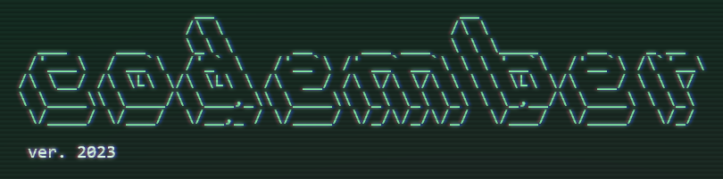

# Codember by [@midudev](https://twitter.com/midudev)

Codember es una colección de retos de programación que ocurre cada año en el mes de noviembre con el objetivo de ayudar a programadores de todo el mundo a desarrollar sus habilidades de lógica y programación.

Este año decidí participar con algunos ejercicios con el fin de practicar mis habilidades con diferentes lenguajes de programación. La idea es realizar cada reto con un lenguaje diferente, aunque puede ser que haga más de algún ejercicio con el mismo.

Al final esto se trata de aprender, mejorar, pero sobre todo divertirse.

## Retos

|                           Reto                           |       Solución        |
| :------------------------------------------------------: | :-------------------: |
|                   Mensajes encriptados                   |   :heavy_check_mark:  |
|                                                          |                       |
|                                                          |                       |
|                                                          |                       |
|                                                          |                       |

## Enlaces de interés
* [https://codember.dev](https://codember.dev)
* [https://midu.dev](https://midu.dev)
